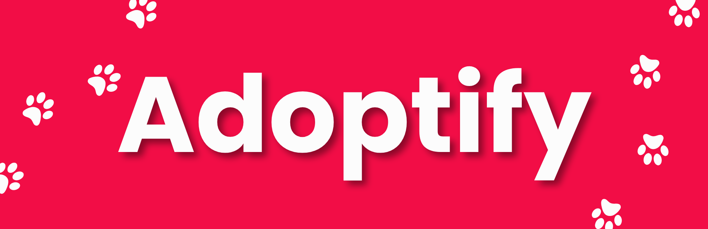

  

# Adoptify

## 📚 Índice de Contenidos

-   [Descripción del Proyecto](#description)
-   [Colaboradores](#collaborators)
-   [Tecnologías](#stack)
-   [Enlaces del Proyecto](#links)

## 📝 Descripción del Proyecto

Adoptify es una plataforma destinada a facilitar la adopción de mascotas, conectando a quienes buscan una mascota con refugios y organizaciones que tienen animales disponibles para adopción. Nuestro objetivo es crear una experiencia de adopción más accesible y eficiente, promoviendo la adopción responsable y ayudando a las mascotas a encontrar un hogar amoroso.

(<a href="#readme-top">ir arriba</a>)

## 🤝 Colaboradores

<table align="center">
  <tr>
    <td align="center"><b>Diego Díaz</b></td>
    <td align="center"><b>Nuri Ibañez</b></td>
    <td align="center"><b>Melania Racacha Flores</b></td>
    <td align="center"><b>Ignacio Revainera</b></td>
  </tr>
  <tr>
    <td align="center"></td>
    <td align="center"></td>
    <td align="center"></td>
    <td align="center"></td>
  </tr>
  <tr>
    <td align="center">Product Manager</td>
    <td align="center">Analista QA</td>
    <td align="center">Diseñadora UX/UI</td>
    <td align="center">Desarrollador Frontend</td>
  </tr>
  <tr>
    <td align="center"></td>
    <td align="center"></td>
    <td align="center"></td>
    <td align="center"></td>
  </tr>
</table>

<table align="center">
  <tr>
    <td align="center"><b>Nestor Rubiano</b></td>
    <td align="center"><b>Hugo Catalán</b></td>
    <td align="center"><b>Sebastián Velarde</b></td>
    <td align="center"><b>Abel Fucili</b></td>
  </tr>
  <tr>
    <td align="center"></td>
    <td align="center"></td>
    <td align="center"></td>
    <td align="center"></td>
  </tr>
  <tr>
    <td align="center">Desarrollador Frontend</td>
    <td align="center">Desarrollador Frontend</td>
    <td align="center">Desarrollador Backend</td>
    <td align="center">Desarrollador Backend</td>
  </tr>
  <tr>
    <td align="center"></td>
    <td align="center"></td>
    <td align="center"></td>
    <td align="center"></td>
  </tr>
</table>

(<a href="#readme-top">ir arriba</a>)

## 🛠️ Tecnologías

### 🎨 UX/UI

### 🗂️ Organización

### 💬 Comunicación

### 🌐 Front-End

### 🖥️ Back-End

(<a href="#readme-top">ir arriba</a>)

## 🔗 Enlaces del Proyecto

[Repositorio en GitHub](https://github.com/tu-repositorio)

[Despliegue del Proyecto (En Desarrollo)](https://tu-deploy-en-desarrollo.com)

(<a href="#readme-top">ir arriba</a>)

